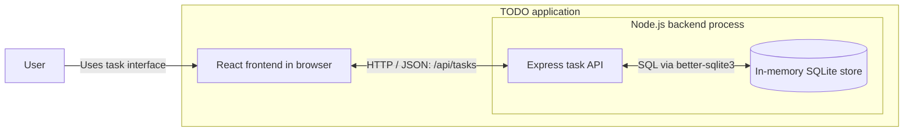
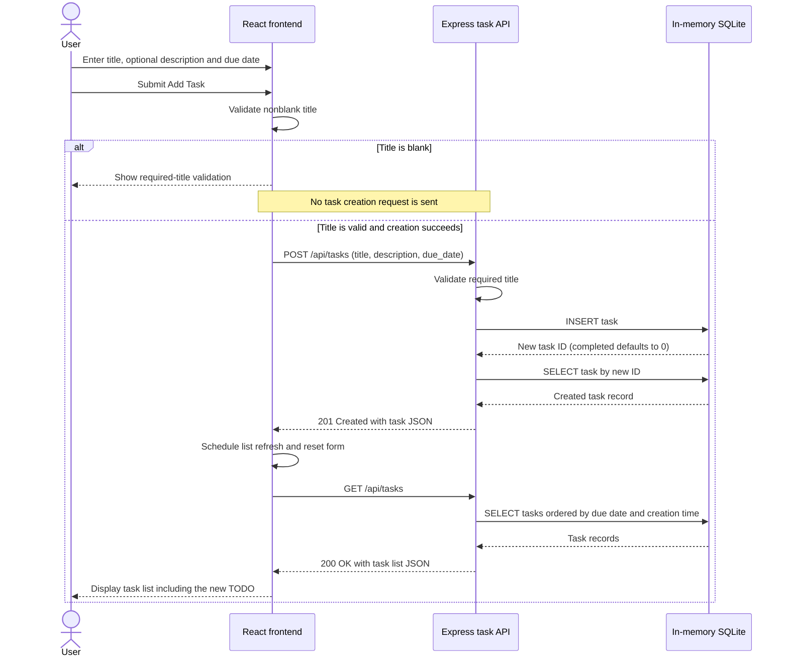

# Cloud Architecture Overview

These diagrams describe the monorepo's current application runtime, not a proposed cloud deployment or the PRD's future local-only task flow. No cloud provider or hosting topology is specified here.

## System Context

## Creating a TODO

The sequence shows frontend title validation and successful task creation. API failure responses and network errors are not depicted.

## Runtime Notes

- **Frontend:** [packages/frontend](../packages/frontend) contains the React UI. It calls relative task API endpoints; the development server proxies requests to `http://localhost:3030`.
- **API:** [packages/backend/src/app.js](../packages/backend/src/app.js) defines Express task endpoints. [packages/backend/src/index.js](../packages/backend/src/index.js) starts the server on port `3030` by default, overridable with `PORT`.
- **Store:** SQLite uses `:memory:` within the backend process, not a separate database service. Task data is lost when the backend process restarts; no durable storage is configured.